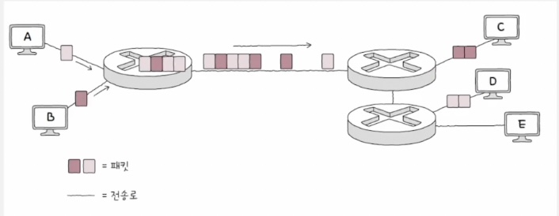

### 1-1. 컴퓨터 네트워크를 알아야 하는 이유

- 개발자는 프로그램을 만드는 개발자, 유지보수하는 개발자로 구분할 수 있다. 둘 다 네트워크에 관한 지식이 필요하다.
- 배포나 오류를 만났을때 네트워크 지식이 필요하다.
- 회사에서도 기본 네트워크 지식을 요구한다.

### 1-2. 네트워크 거시적으로 살펴보기

- 컴퓨터 네트워크
    - 여러 장치가 연결되어 정보를 주고받을 수 있는 통신망
    - **그래프(노드와 간선의 조합)** 자료구조 형태를 띈다.
- 인터넷
    - 여러 네트워크를 연결한 **네트워크의 네트워크**
    - 인터넷 덕분에 지구 반대편의 네트워크와 통신할 수 있음

### 기본 구조

- 호스트
    - 가장자리에 위치한 노드
    - 네트워크 가장자리에 자리 잡고 있다는 점에서 종단 시스템(end system)이라고도 한다.
    - **클라이언트** : 서비스를 요청하고 응답받는 호스트
    - **서버** : 서비스를 제공, 요청에 응답하는 호스트
- 네트워크 장비
    - 중간에 위치한 노드
    - 호스트 간 주고받는 정보가 원하는 수신지까지 안정적이고 안전하게 전송될 수 있도록 한다.
    - ex) 이더넷 허브, 스위치, 라우터, 공유기 등

<aside>
☝

**호스트(클라이언트&서버)와 네트워크 장비의 구분**

- 이는 칼로 자르듯 명확하게 구분되는 개념이 아니다.
- 단지 노드의 역할에 따라 구분한 기준에 불과하다.
- 각 노드가 클라, 서버, 네트워크 장비 어떤 것이든 될 수 있다.
</aside>

- 통신매체
    - 노드 간 연결하는 링크
    - 유선으로 연결하는 유선 매체, 무선으로 연결하는 무선 매체가 있다.
- 메시지
    - 노드 간 주고받는 정보
    - 통신 매체로 연결된 노드가 주고받는 정보 (웹페이지, 파일, 메일 등)

### 범위에 따른 네트워크 분류

- LAN(Local Area Network) : 가까운 지역을 연결한 근거리 통신망
- WAN(Wide Area Network) : 먼 지역을 연결하는 광역 통신망
    - 다른 LAN에 속한 호스트와 메시지를 주고받아야 할 때는 WAN이 필요
    - 인터넷이 WAN으로 분류된다
    - ISP라는 인터넷 서비스 업체가 구축하고 관리한다.
        - 국내엔 SK브로드밴드, KT, LG유플러스

### 메시지 교환 방식에 따른 네트워크 분류

- 회선 교환 방식
    - 메시지 전송로인 회선을 먼저 설정(예약)하고 이를 통해 메시지를 주고받는 방식
    - 회선 스위치 : 호스트 간 회선을 적절하게 설정하는 네트워크 장비
    - 장점 : 주어진 시간 동안 전송되는 정보의 양이 비교적 일정
    - **단점 : 회선의 이용 효율이 낮다.**
- 패킷 교환 방식
    
    
    
    - 회선 교환 방식의 단점을 해결한 방식으로, 메시지를 패킷이라는 작은 단위로 쪼개어 전송
    - 패킷 : 패킷 교환 네트워크상에서 송수신되는 메시지의 작은 단위
        - 페이로드(물품) : 전송하고자 하는 데이터
        - 헤더, 트레일러(택배 송장) : 패킷에 붙는 부가정보, 제어정보
    - 패킷 스위치
        - 패킷이 수신지까지 올바르게 도달할 수 있도록 최적의 경로를 결정하거나 패킷의 송수신지를 식별
        - 대표적으로 라우터와 스위치가 있다.

### 주소와 송수신지 유형에 따른 전송 방식

- 패킷의 헤더에 담기는 대표적인 정보, **주소(address**)
- 송수신지를 특정하는 정보
    - ex) IP 주소, MAC 주소
- 주소가 있으면 누구에게 전송할지를 지정할 수 있다.
    - ex) 특정 기기 하나에 전송, 같은 네트워크 내 모든 기기로 전송 등
- 송수신지 유형별 전송방식
    - **유니캐스트**
        - 하나의 수신지에 메시지를 전송하는 방식
        - 송신지와 수신지가 일대일, 가장 일반적인 형태
    - **브로드캐스트**
        - 네트워크 상 모든 호스트에게 전송
        - 브로드캐스트 도메인 : 브로드캐스트가 전송되는 범위
            - LAN의 범위를 브로드캐스트 도메인으로 보는 경우가 많다.
    - 멀티캐스트
        - 네트워크 내의 동일 그룹에 속한 호스트에게만 전송
    - 애니캐스트
        - 네트워크 내 동일 그룹에 속한 호스트 중 가장 가까운 호스트에게 전송